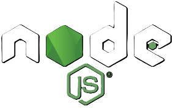
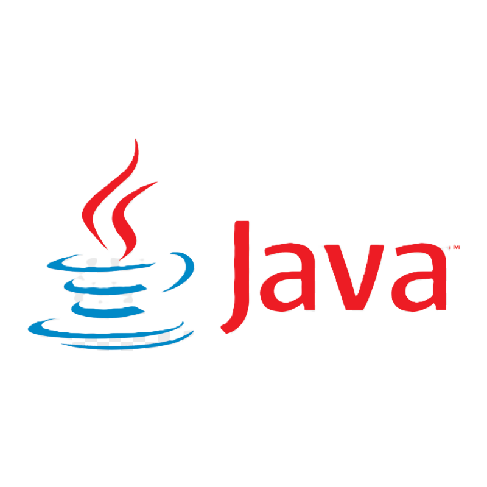

<table>
  <tr>
    <td width="60%">
      <h2 align="left">Hey there! I'm Sana Fathima</h2>
      I'm currently pursuing a B.E in Information Science and Engineering, with a deep interest in building intelligent and impactful technology solutions. 
      From full-stack web development to AI-powered applications, I enjoy creating tools that are not only functional but also meaningful. 
      I'm especially passionate about using tech for social good—whether it's through accessible AI assistants, health diagnostics, or disaster prediction platforms. 
      My goal is to keep learning, keep building, and contribute to real-world problem-solving through code.
    </td>
    <td>
      
    </td>
  </tr>
</table>

### 🛠️ My Skills

  &nbsp;&nbsp;&nbsp;&nbsp;&nbsp;&nbsp;&nbsp;
  &nbsp;&nbsp;&nbsp;&nbsp;&nbsp;&nbsp;&nbsp;
  &nbsp;&nbsp;&nbsp;&nbsp;&nbsp;&nbsp;&nbsp;
  &nbsp;&nbsp;&nbsp;&nbsp;&nbsp;&nbsp;&nbsp;
  &nbsp;&nbsp;&nbsp;&nbsp;&nbsp;&nbsp;&nbsp;
  &nbsp;&nbsp;&nbsp;&nbsp;&nbsp;&nbsp;&nbsp;
 
  &nbsp;&nbsp;&nbsp;&nbsp;&nbsp;&nbsp;&nbsp;
  &nbsp;&nbsp;&nbsp;&nbsp;&nbsp;&nbsp;&nbsp;
  &nbsp;&nbsp;&nbsp;&nbsp;&nbsp;&nbsp;&nbsp;&nbsp;&nbsp;
  &nbsp;&nbsp;&nbsp;&nbsp;&nbsp;&nbsp;&nbsp;&nbsp;&nbsp;&nbsp;
  &nbsp;&nbsp;&nbsp;&nbsp;&nbsp;&nbsp;&nbsp;&nbsp;&nbsp;
  

### 📊 GitHub Stats

  

  

  

---

### 🌐 Connect with Me

- 💼 [Portfolio Website](https://sanafathima.netlify.app/)
- 🔗 [LinkedIn](https://www.linkedin.com/in/sana-fathima-2156792a9)
